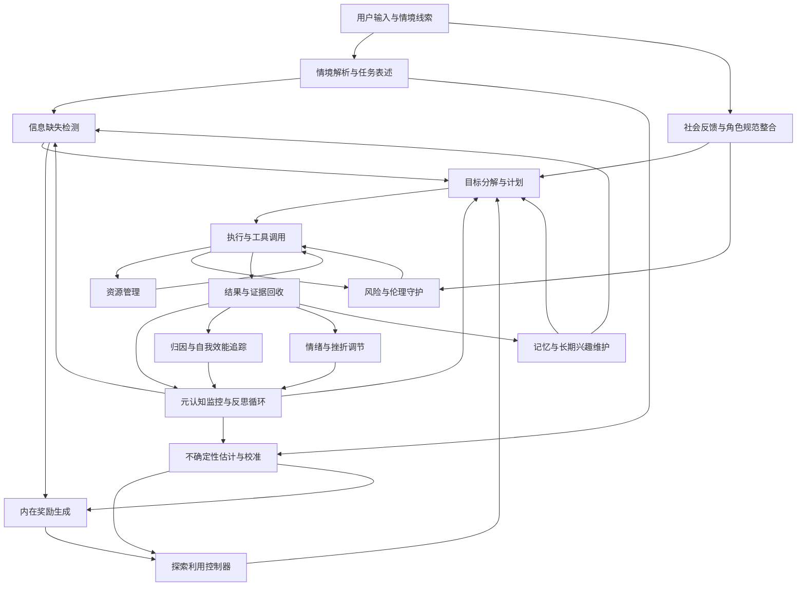
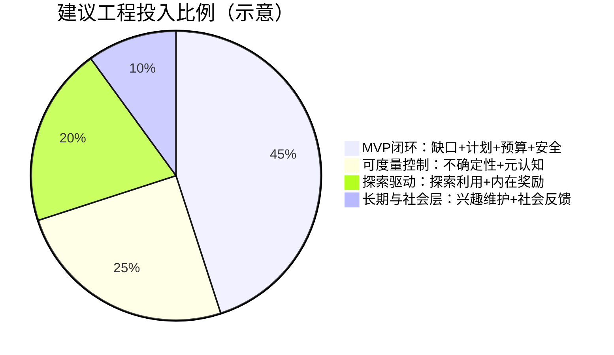

# 人类如何实现自我驱动力与自我解决问题能力的证据与面向 Agent 的工程化映射报告

## 执行摘要

在人类研究中，自我驱动力常被拆成两类互相耦合的机制：一类来自“对未知的牵引”，典型表现为好奇心(Curiosity)与信息寻求；另一类来自“把问题做完的持续性”，典型表现为自我调节(Self-regulation)、元认知(Metacognition)、目标管理与情绪调节。现有证据表明，好奇心并不是单一冲动，而是一套从“检测信息缺口”到“把信息获取当作奖励”再到“在探索与利用之间做权衡”的复合系统，其中神经层面的奖赏预测误差(Reward Prediction Error, RPE)与行为层面的不确定性管理共同解释了许多实验现象（Loewenstein 1994；Kidd and Hayden 2015；Schultz, Dayan, and Montague 1997；Cohen, McClure, and Yu 2007）。citeturn0search8turn0search17turn1search4turn3search1

对“为什么能坚持解决问题”的解释，更多依赖目标系统与自我调节闭环：明确目标会提升注意与努力投入，持续的监控与反馈回路会把偏差变成下一步行动调整，而元认知框架强调“对象层与元层”的分工，使个体能够在不确定时采取检索信息、改策略或降低风险的控制动作（Locke and Latham 2002；Nelson and Narens 1990；Carver and Scheier 1982）。citeturn0search11turn3search16turn10search9

社会学与社会心理的证据提示，自我驱动并不只来自个体内部。角色期待与角色清晰度会影响行动的优先级与边界，社会支持的结构与过程会影响压力下的动机维持，社会规范在被“凸显”时会改变行为选择，而制度化激励可能出现“挤出效应”，在部分条件下削弱内在动机（Biddle 1986；House, Umberson, and Landis 1988；Cialdini, Kallgren, and Reno 1991；Frey and Jegen 2001）。citeturn5search5turn8search10turn11search6turn6search24

将这些机制映射为可工程化的 Agent 模块时，比较稳妥的做法是把“好奇驱动”当作一组可度量的内部信号生成与控制策略，把“解题能力”当作计划执行与自我监控的循环结构，然后把社会机制落到“角色与规范层”“反馈整合层”和“资源与权限层”。本报告给出 10 个模块，覆盖信息缺失检测、内在奖励生成、探索利用控制、元认知监控、目标分解计划、长期兴趣维护、归因与自我效能、情绪调节、社会反馈整合、资源与伦理守护，并为每个模块给出数据结构片段、策略建议、触发条件与验证方法。citeturn4search7turn4search6turn2search4turn3search6turn11search4

## 理论与证据基础

好奇心的经典心理学解释之一是信息缺口理论(Information-Gap Theory)。它把好奇心视为当注意聚焦在“已知与想知道之间的差距”时出现的一种驱动状态，并预测好奇与信息量之间可能呈现非线性关系，因为差距太小不值得动，差距太大又可能变成挫败与回避（Loewenstein 1994）。citeturn0search8

近年的权威综述把好奇心与信息寻求的证据分成若干条线索：发展与学习任务中的主动采样、决策任务中的探索利用权衡、以及神经层面与奖赏系统耦合的证据。该综述同时指出，实验范式的不统一导致度量困难，因此可工程化映射时更适合围绕“可操作的中间变量”，例如不确定性、信息增益、预测误差与学习进度，而不是把好奇当作单一分数（Kidd and Hayden 2015）。citeturn0search17turn0search29

一条与工程实现高度对齐的证据链来自“信息寻求即一种价值计算”。在计算与神经机制综述中，信息与注意被描述为主动采样过程，动物和人会在缺少外在奖励时仍投入资源获取信息，这推动了把信息价值写成“预期信息增益”或“学习进度”的建模方式（Gottlieb et al. 2013）。citeturn4search7turn4search11

同时，奖赏学习框架把好奇与兴趣(Interest)放进了更大的“知识获取的奖励学习”图景：知识增长本身可以充当内在奖励，进而通过类似强化学习的更新机制强化信息寻求行为；该框架也讨论了内在奖励与外在奖励的相似性与差异性，以及长期兴趣如何在重复的知识积累中形成（Murayama 2022）。citeturn4search6turn4search10

在内在动机方面，自我决定理论(Self-Determination Theory, SDT)强调自主性(Autonomy)、胜任感(Competence)与联结感(Relatedness)三类基本心理需要。理论的工程含义是，持续动机并不只靠奖励强度，还与“是否感到被控制”“是否能体验到有效性”“是否感到关系安全”强相关（Deci and Ryan 2000）。citeturn0search10turn0search2

关于外在奖励对内在动机的影响，长期存在争论。针对实验研究的元分析给出了较分化的结论与条件效应：不同奖励类型、奖励与任务的耦合方式、以及测量口径会显著改变方向与大小，因此工程上更现实的做法是把奖励机制做成“条件化策略”，并在评估中专门观察是否出现“内在兴趣被挤出”的迹象（Deci, Koestner, and Ryan 1999；Cameron and Pierce 1994；Lepper et al. 1999）。citeturn4search28turn4search13turn4search36

问题解决的持续性与效率则更依赖目标管理与自我调节。目标设定理论的大量证据支持：具体且有挑战的目标通常能提升表现，并通过注意聚焦、努力、坚持与策略等机制起作用，同时目标需要反馈与承诺条件才能稳定落地（Locke and Latham 2002）。citeturn0search11turn0search23

元认知研究提供了“监控与控制”的抽象接口。经典框架把系统分为对象层(object-level)与元层(meta-level)，元层对对象层进行信心评估、错误检测与控制动作选择，例如决定是否继续检索信息或改变策略（Nelson and Narens 1990；Flavell 1979）。citeturn3search16turn1search14

探索利用与奖赏预测误差的证据使“好奇驱动”与“解题策略”连接到统一的学习信号上。多巴胺相关的预测误差被用来解释学习如何由期望改变驱动，并成为工程上把“惊讶”或“预测误差”作为内部奖励信号的理论支点（Schultz, Dayan, and Montague 1997）。citeturn1search4turn1search8 另一方面，人类在探索与利用之间的权衡涉及前额叶等区域，并能在实验任务中被观测到（Daw et al. 2006；Cohen, McClure, and Yu 2007）。citeturn1search5turn3search1

社会层面的证据将“持续动机”放回到角色与制度环境里。角色理论强调角色作为行为模式与期待体系，会影响个体的行为优先级、冲突体验与持续投入（Biddle 1986）。citeturn5search5 关于社会支持，社会学综述指出支持的结构与过程会通过压力缓冲、资源获取与意义建构影响健康与行为持续性（House, Umberson, and Landis 1988），心理学综述则系统讨论了缓冲模型与主效应模型以及测量难点（Cohen and Wills 1985）。citeturn8search10turn1search11 规范研究进一步表明，当某类规范被凸显时，行为会朝该规范偏移，这为工程实现“规范提醒与角色提示”的触发机制提供了可检验路径（Cialdini, Kallgren, and Reno 1991）。citeturn11search6turn11search2

## 关键认知机制

下表把自我驱动力与自我解决问题能力中最常被复现、也最容易工程化的认知机制列为“中间变量”。每个条目给出简短定义，并说明主要证据来自哪类研究与哪些核心来源。

| 认知机制 | 简短定义 | 主要证据与可观察结果 | 代表性来源 |
| --- | --- | --- | --- |
| 信息缺失检测 | 识别“我不知道但我想知道”的缺口，并把缺口大小转成驱动力强度 | 信息缺口理论解释好奇的启动与饱和，实验任务中可通过信息选择、等待成本、信息购买等方式观察 | （Loewenstein 1994）。citeturn0search8 |
| 信息价值与信息增益 | 把信息本身当作具有主观价值的对象，目标是降低不确定性或提升后续决策质量 | 综述将信息寻求视为主动采样与价值计算，强调信息增益与注意资源分配的耦合 | （Gottlieb et al. 2013）。citeturn4search7 |
| 奖赏预测误差驱动学习 | 用“结果与预期的差”更新价值与策略，惊讶可成为学习信号 | 多巴胺相关预测误差被用于解释学习与价值更新，成为把预测误差写成内在奖励的理论支点 | （Schultz, Dayan, and Montague 1997）。citeturn1search4 |
| 探索与利用权衡 | 在“继续用已知最好策略”与“尝试未知选项”之间做资源分配 | 人类实验与神经证据支持这一权衡存在可分离的策略与神经关联 | （Daw et al. 2006；Cohen, McClure, and Yu 2007）。citeturn1search5turn3search1 |
| 元认知监控与控制 | 元层评估对象层的正确性与不确定性，并选择控制动作 | 对象层与元层框架解释了信心判断、FOK、学习策略选择等现象 | （Nelson and Narens 1990；Flavell 1979）。citeturn3search16turn1search14 |
| 目标设定与目标对齐 | 把期望状态转成可执行标准，并通过反馈回路缩小偏差 | 目标设定证据强调具体与挑战目标对表现的影响，以及反馈与承诺的作用 | （Locke and Latham 2002）。citeturn0search11 |
| 自我效能与归因更新 | 对“我能否做到”的信念，以及对成功失败原因的解释，会影响坚持与策略选择 | 自我效能理论预测效能信念会影响启动、努力与坚持；归因理论将情绪与后续动机连接到因果解释 | （Bandura 1977；Weiner 1985）。citeturn2search4turn2search17 |
| 情绪调节与挫折耐受 | 用重评、抑制等策略调节情绪，以避免焦虑或挫败压制探索与解题 | 情绪调节综述提出前因聚焦与反应聚焦策略的差异及其后果 | （Gross 1998）。citeturn3search6turn3search10 |
| 延迟折扣与时间一致性 | 对未来收益的主观价值随延迟下降，影响长期任务的坚持与延迟满足 | 延迟折扣综述总结了折扣函数形态与跨群体差异，并讨论测量与解释 | （Odum 2011）。citeturn11search7turn11search3 |
| 长期兴趣维护 | 把重复的知识增长与积极体验积累为稳定兴趣，从而降低后续启动成本 | 奖励学习框架解释兴趣与好奇如何在长期知识积累中形成与维持 | （Murayama 2022；Kidd and Hayden 2015）。citeturn4search6turn0search17 |

## 关键社会机制

社会机制对自我驱动的影响不只是“有人鼓励就更努力”，而是更具体地体现在角色边界、反馈结构、规范激活与资源可得性上。下表把更可工程化的社会机制整理为可实现的控制变量。

| 社会机制 | 作用方式 | 对好奇与解题持续性的影响路径 | 代表性来源 |
| --- | --- | --- | --- |
| 角色期待与角色清晰度 | 角色为个体提供行为标准与优先级，并定义何种行为被视为合适 | 角色清晰度提升可减少冲突成本，使长期投入更可预测；角色冲突会提高耗竭与动机波动，进而削弱持续探索 | （Biddle 1986）。citeturn5search5 |
| 社会支持的结构与过程 | 支持既包括情感支持也包括工具性支持，且依赖网络结构与关系质量 | 支持可通过压力缓冲提高在失败与不确定性下的坚持，也可通过资源提供降低信息获取成本 | （House, Umberson, and Landis 1988；Cohen and Wills 1985）。citeturn8search10turn1search11 |
| 规范激活与规范提醒 | 规范是否影响行为，取决于规范在情境中是否被凸显并被识别 | 当“应该如何做”被提示时，行为更可能向规范靠拢，这会改变探索边界与风险偏好，例如更愿意遵循诚信与隐私规范 | （Cialdini, Kallgren, and Reno 1991）。citeturn11search6turn11search2 |
| 制度化激励与动机挤出 | 外部干预可能被体验为控制，从而削弱自主性并影响内在动机 | 在部分条件下，外在激励可能让个体把任务解释为“为奖励而做”，导致好奇与自发探索下降；也存在条件下不会挤出甚至促进 | （Frey and Jegen 2001；Deci, Koestner, and Ryan 1999；Cameron and Pierce 1994）。citeturn6search24turn4search28turn4search13 |
| 社会资本与资源可得性 | 关系网络提供信息渠道、信任与协作机会，从而改变资源约束 | 资源可得性越高，探索与试错的边际成本越低，个体更可能持续开展问题分解与外部求助 | （Coleman 1988）。citeturn5search15turn5search19 |
| 社会互动风险与信任边界 | 在强人格化交互中，信任与影响力可能被放大，风险随之上升 | 对 Agent 而言，社会环境会把好奇转化为“对个人信息的探询”或“对他人的推断”，需要治理层限制与审计 | （Weidinger et al. 2021；Bender et al. 2021）。citeturn11search4turn11search1 |

## 模块映射与实现细节

下表把上述认知与社会机制逐项映射为工程模块。数据结构示例以文件化配置为主，便于在未指定底层模型或运行平台时仍保持可移植性。算法建议以策略级描述为主，不给出可直接运行的完整代码实现。

| 模块/任务 | 功能 | 数据结构示例 | 算法建议 | 触发条件 | 验证指标 | 开发复杂度 | 验证难度 |
| --- | --- | --- | --- | --- | --- | --- | --- |
| 信息缺失检测 | 从用户问题、当前计划与知识状态中识别“必须补齐”和“可选补齐”的信息缺口，并估计缺口大小 | `gaps.yaml` 记录 gap 项、重要度、可测试假设 | 信息缺口评分：目标依赖度＋不确定性；将 gap 与任务图绑定；对 gap 做去重与层级聚合（Loewenstein 1994）。citeturn0search8 | 生成计划前；连续失败时；出现高不确定性表述时 | Gap 识别召回率；对最终成功率的边际提升；误报率 | 中 | 中 |
| 不确定性估计与校准 | 为当前结论、候选动作与工具调用结果估计不确定性，并做校准 | `beliefs.json`：命题、置信度、证据指针 | 近似贝叶斯：集成投票、温度缩放校准；将不确定性写入元认知接口（Nelson and Narens 1990）。citeturn3search16 | 需要做关键决策或对外承诺；证据不足；多路径冲突 | 置信度校准误差(Brier/ECE)；错误高置信比例 | 中 | 高 |
| 内在奖励生成 | 把信息增益、学习进度或预测误差转成内部奖励，驱动探索与持续学习 | `intrinsic_reward.yaml`：奖励权重、衰减、上限 | 信息增益奖励；学习进度奖励；预测误差奖励，以防止无差别探索（Schultz, Dayan, and Montague 1997；Gottlieb et al. 2013）。citeturn1search4turn4search7 | 外在奖励稀疏；任务卡住；存在多个等价子问题 | 探索效率；到达新知识状态的速度；无效探索比例 | 高 | 高 |
| 探索利用控制器 | 在“继续当前最优路径”与“探索新路径/新工具/新分解”间分配预算 | `policy.yaml`：探索率、UCB 参数、时间预算 | 多臂老虎机策略：UCB/Thompson；将探索决策与预算约束耦合（Daw et al. 2006；Cohen, McClure, and Yu 2007）。citeturn1search5turn3search1 | 存在多个可行动作；信息不足以区分动作价值；预算仍充足 | 累积后悔(regret)近似；成功率与成本的帕累托改进 | 中 | 中到高 |
| 目标分解与计划模块 | 将任务转为层次子目标，并生成可执行计划与检查点 | `plans.yaml`：目标树、依赖、里程碑、工具需求 | 层次任务分解(HTN)或目标树；计划可在回路中更新；把目标具体化以提升执行（Locke and Latham 2002）。citeturn0search11 | 接到新任务；出现大型问题；执行偏离阈值 | 任务完成率；步骤返工率；计划可解释性评分 | 中 | 中 |
| 元认知监控与反思循环 | 监控错误、置信度、进度与策略有效性，并触发反思与策略切换 | `meta.jsonl`：每轮监控点、触发原因、修正决策 | 对象层与元层分离；监控信号包括冲突、低置信、高代价；反思输出为“下一轮控制动作”（Nelson and Narens 1990；Flavell 1979）。citeturn3search16turn1search14 | 概率性错误信号；连续失败；高风险输出前 | 自我纠错率；错误恢复时间；反思带来的成功率提升 | 中 | 高 |
| 长期兴趣维护与主题记忆 | 将持续产生内在奖励的主题形成“兴趣画像”，用于长期学习路线与复用 | `interests.yaml`：主题、奖励轨迹、饱和与复燃条件 | 以学习进度曲线识别“可学区间”；用衰减与新颖性保持多样性（Murayama 2022）。citeturn4search6 | 任务空档；用户允许自主学习；长期项目模式 | 自主学习产出质量；兴趣漂移率；重复无效学习比例 | 高 | 高 |
| 归因与自我效能追踪 | 对失败原因做结构化归因，并更新“我能否完成/需要何种支持”的信念 | `self_efficacy.yaml`：能力信念、近期成功率、归因摘要 | 将失败分为信息不足、计划错误、执行错误；把效能信念与策略选择耦合（Bandura 1977；Weiner 1985）。citeturn2search4turn2search17 | 失败或成功后；用户反馈显著时；资源不足时 | 持续性指标；在困难任务中的放弃率；策略多样性 | 中 | 中到高 |
| 情绪与挫折调节模块 | 识别挫折与焦虑迹象，并通过重评、降难度、切分任务的方式维持探索 | `affect.yaml`：阈值、调节策略序列 | 情绪调节策略库；优先使用重评而非压制；与预算和风险联动（Gross 1998）。citeturn3search6turn3search10 | 连续失败；信息缺口过大；内部奖励下降且成本上升 | 失败后的恢复速度；负向循环次数；用户体验评分 | 中 | 高 |
| 社会反馈与角色规范整合 | 建模用户角色、情境规范与社会反馈，将其转为动机维护或边界约束 | `social_context.yaml`：角色、规范提醒、反馈信号 | 角色清晰度与规范提示作为控制输入；处理激励挤出风险（Biddle 1986；House, Umberson, and Landis 1988；Cialdini, Kallgren, and Reno 1991；Frey and Jegen 2001）。citeturn5search5turn8search10turn11search6turn6search24 | 新会话或通道变化；用户显式反馈；涉及敏感话题 | 角色一致性；规范违背率；被用户纠正次数 | 高 | 高 |
| 资源管理与工具调用 | 管理时间、token、工具成本与外部调用配额，并把成本纳入探索利用策略 | `budgets.yaml`：token、时间、工具成本、配额 | 成本敏感规划；对工具调用做价值阈值；将预算作为硬约束输入到策略层（Sutton and Barto 2018）。citeturn2search3 | 任何工具调用前；预算接近阈值；高并发任务 | 单任务成本；单位成本成功率；预算超限次数 | 中 | 中 |
| 风险与伦理守护 | 防止操纵性好奇、隐私泄露、资源滥用与越权探索，将风险审计与阻断做成强制层 | `safety_policy.yaml`：禁区、需确认、审计级别 | 风险分类与门槛；强制确认与最小权限；行为审计与回放；对社会互动伤害做专门检测（Weidinger et al. 2021；Bender et al. 2021）。citeturn11search4turn11search1 | 涉及个人数据或外联；模型提出高风险行动；用户请求越界 | 红队通过率；敏感信息泄露率；越权尝试拦截率 | 高 | 高 |

### 模块配置片段示例

下面给出一个把上述模块放进同一份文件配置的例子，用于说明字段形态与模块间如何共享变量。字段名只是约定示例，实际需要与运行平台的事件系统和存储层对齐。

```yaml
agent_motivation_stack:
  gap_detector:
    enabled: true
    gap_score:
      goal_dependency_weight: 0.55
      uncertainty_weight: 0.35
      user_value_weight: 0.10
    promote_to_plan_threshold: 0.70

  uncertainty_calibrator:
    enabled: true
    method: "ensemble_vote_then_temperature_scaling"
    record_beliefs_path: "memory/beliefs.json"

  intrinsic_reward:
    enabled: true
    components:
      information_gain: 0.45
      learning_progress: 0.35
      prediction_error: 0.20
    saturation:
      per_topic_daily_cap: 1.0

  explore_exploit_controller:
    enabled: true
    strategy: "UCB"
    ucb_c: 1.2
    exploration_budget_ratio: 0.25

  planner:
    enabled: true
    decomposition: "goal_tree"
    checkpoint_policy:
      max_steps_between_checks: 3

  metacognition:
    enabled: true
    triggers:
      low_confidence: 0.55
      repeated_failures: 2
      high_cost_action: true
    default_controls:
      - "ask_for_missing_info"
      - "switch_subgoal"
      - "retrieve_evidence"

  self_efficacy_attribution:
    enabled: true
    attribution_schema: ["info_gap", "plan_error", "execution_error", "external_constraint"]
    update_rate: 0.10

  affect_regulation:
    enabled: true
    frustration_threshold:
      consecutive_failures: 3
      cost_growth_ratio: 1.6
    strategies_in_order: ["reappraise", "reduce_scope", "request_help", "stop_and_report"]

  social_context:
    enabled: true
    role_templates:
      default: "collaborative_problem_solver"
    norm_prompts:
      - "privacy_respect"
      - "non_manipulation"
      - "transparency_about_uncertainty"

  resource_manager:
    enabled: true
    budgets:
      max_tokens_per_task: 6000
      max_tool_calls: 12
      max_wall_time_seconds: 240

  safety_guard:
    enabled: true
    hard_blocks:
      - "covert_persuasion"
      - "sensitive_personal_data_inference"
      - "unauthorized_external_contact"
    require_confirmation:
      - "send_message"
      - "download_or_upload_files"
    audit:
      log_path: "logs/safety_audit.jsonl"
```

如需参考文件化工程落地方式，OpenClaw 这类以工作区文件注入人格与记忆的框架，可以作为工程来源的例子，但不能当作心理学或社会学证据使用。citeturn0search17

## 总体架构与 MVP 优先级

### 总体架构流程图



该架构刻意把“控制”与“生成”分开：信息缺失、不确定性、内在奖励、资源预算与安全风险都作为可测量的控制信号输入到计划与执行层，这样才能更接近人类研究中的“监控与控制”分工（Nelson and Narens 1990；Gottlieb et al. 2013）。citeturn3search16turn4search7

### MVP 组成与优先级

在未指定底层模型或运行平台的前提下，MVP 更适合围绕“可验证的闭环”来定：先把信息缺失检测与计划执行做稳，再把不确定性与元认知加入，随后引入探索利用与内在奖励，最后再做长期兴趣与更复杂的社会机制。该顺序的理由是，前几项能直接用任务成功率与成本指标验证，而内在奖励与长期兴趣更依赖长期实验与更复杂的对照设计（Kidd and Hayden 2015；Murayama 2022）。citeturn0search17turn4search6

| 模块/任务 | 功能焦点 | MVP 建议形态 | 开发复杂度 | 验证难度 | 主要验证方式 |
| --- | --- | --- | --- | --- | --- |
| 信息缺失检测 | 把“缺什么”显式化并进入计划 | 最小实现为 gap 列表加重要度评分与阈值晋升 | 中 | 中 | 任务成功率提升、误报率、计划返工率 |
| 目标分解与计划模块 | 把任务变成可执行步骤 | 目标树＋检查点；优先支持工具前置条件与依赖 | 中 | 中 | 完成率、步骤冗余度、用户纠正次数 |
| 资源管理与工具调用 | 防止成本失控，支持稳定评估 | token 与工具调用配额硬约束；成本敏感执行 | 中 | 中 | 单任务成本、预算超限次数、成本效率 |
| 风险与伦理守护 | 把高风险行为变成强制拦截 | 禁区列表＋需确认列表＋审计日志 | 高 | 中到高 | 红队通过率、泄露率、越权拦截率 |
| 元认知监控与反思循环 | 让系统能自我纠错与切换策略 | 低置信与重复失败触发反思，输出控制动作 | 中 | 高 | 自我纠错率、恢复时间、校准误差 |
| 不确定性估计与校准 | 给元认知提供可靠输入 | 集成式置信度＋温度缩放；记录到 beliefs | 中 | 高 | ECE/Brier、错误高置信比例 |
| 探索利用控制器 | 避免盲目探索或过度保守 | UCB 或 Thompson 作为默认策略，受预算约束 | 中 | 中到高 | regret 近似、成功率与成本帕累托改善 |
| 内在奖励生成 | 给“自主探索”提供驱动信号 | 信息增益＋学习进度的线性组合，带上限与衰减 | 高 | 高 | 无外在奖励任务的探索效率、无效探索比例 |
| 社会反馈与角色规范整合 | 改善长期协作与边界一致性 | 先做“角色模板＋规范提醒＋反馈信号记忆” | 高 | 高 | 角色一致性、规范违背率、满意度与留存 |
| 长期兴趣维护与主题记忆 | 支持长期学习路线与复用 | 主题奖励轨迹＋饱和机制；仅在允许自主学习时开启 | 高 | 高 | 长期产出质量、兴趣漂移率、重复学习比例 |

### 优先级投入分配示意

下图以“建议的工程投入比例”展示从 MVP 到增强阶段的大致资源分配，目的是便于工程讨论时做取舍。比例并不代表绝对工期，而是表示在未指定平台的情况下，哪些组件通常更快形成可验证闭环。



## 风险、伦理与优先阅读

### 主要风险与缓解策略

过度探索风险在好奇驱动系统中非常常见，因为当内部奖励设计不当时，系统可能追逐新奇而忽视任务价值，或者在工具环境中产生高成本试错。缓解策略通常需要把“探索预算”与“任务价值阈值”做成硬约束，并在日志里记录探索带来的信息增益，用于离线回放与调参（Cohen, McClure, and Yu 2007；Sutton and Barto 2018）。citeturn3search1turn2search3

操纵性好奇风险指的是系统为了满足信息缺口而倾向于询问不必要的个人信息，或利用人格化互动诱导用户暴露信息与偏好。缓解策略需要在安全层显式禁止“对敏感属性的推断”和“以非透明方式影响用户决策”，并把所有涉及个人数据的问题设置为“需解释用途与需用户同意”的交互协议。语言模型风险综述专门把人机交互伤害、信息危害与隐私风险列入系统性风险版图，可作为审查清单（Weidinger et al. 2021）。citeturn11search4turn11search16

隐私泄露与资源滥用风险在“自我驱动学习”场景会被放大，因为系统更主动地调用工具、收集资料并写入记忆。缓解策略需要把记忆分层，把可识别个人信息排除出长期记忆，限制外部检索来源，并对外联与数据导出采用最小权限与可回放审计。对语言模型训练与部署外部性风险的讨论提醒，工程上需要把风险控制前置到设计阶段，而不是只靠事后纠错（Bender et al. 2021）。citeturn11search1turn11search5

文化偏差风险在动机系统中表现为“把某种社会规范当成普遍规范”，例如把直接表达当成唯一优先的沟通风格，或把某种激励结构默认视为有效。缓解策略需要把角色模板与规范提示做成本地化可配置，并在评估中加入跨文化与跨情境测试集，同时为用户提供可见的角色与偏好设置入口。规范研究强调规范必须在情境中被识别并被凸显才会起作用，这也意味着“规范提示”本身需要情境化，而不是一条固定口号（Cialdini, Kallgren, and Reno 1991）。citeturn11search6turn11search2

### 伦理审查流程建议

一个比较可执行的审查流程通常包括四个阶段：首先做威胁建模，把好奇驱动可能触达的“数据类型、外联能力、工具权限”列成清单；随后定义硬阻断与需确认策略，并把其覆盖在所有外部动作之上；第三阶段用红队测试覆盖提示注入、社工诱导与敏感信息探测等情景；最后将日志与回放工具纳入常态化审计，并用版本化配置确保策略可追溯。风险分类与审计清单可以参考语言模型风险分类与术语表，例如把风险分为歧视、信息危害、误导、恶意用途、人机交互伤害等类别，以避免遗漏（Weidinger et al. 2021）。citeturn11search4turn11search12

### 优先阅读文献 Top 12

以下清单优先选择原始论文或权威综述，并尽量给出 DOI。注释聚焦于其对“好奇驱动与问题解决”工程化最有用的可操作变量与方法论启示。

1. The Psychology of Curiosity: A Review and Reinterpretation（1994，Psychological Bulletin）DOI: 10.1037/0033-2909.116.1.75。信息缺口理论的经典来源，用于把“缺口评分”与“好奇饱和”做成可实现的控制信号（Loewenstein 1994）。citeturn0search8turn0search28  
2. The Psychology and Neuroscience of Curiosity（2015，Neuron）DOI: 10.1016/j.neuron.2015.09.010。跨心理学与神经科学的综述，强调测量范式不统一以及把好奇拆成多种中间变量的必要性（Kidd and Hayden 2015）。citeturn0search17turn0search29  
3. Information-seeking, curiosity, and attention: computational and neural mechanisms（2013，Trends in Cognitive Sciences）DOI: 10.1016/j.tics.2013.09.001。把信息寻求写成主动采样与价值计算的综述，对“信息增益奖励”和“主动检索策略”工程化很直接（Gottlieb et al. 2013）。citeturn4search7turn4search11  
4. A reward-learning framework of knowledge acquisition: An integrated account of curiosity, interest, and intrinsic–extrinsic rewards（2022，Psychological Review）DOI: 10.1037/rev0000349。把好奇与兴趣放入奖励学习框架，特别适合指导“长期兴趣维护模块”的状态变量设计（Murayama 2022）。citeturn4search6turn4search10  
5. The “What” and “Why” of Goal Pursuits: Human Needs and the Self-Determination of Behavior（2000，Psychological Inquiry）DOI: 10.1207/S15327965PLI1104_01。用于把自主性、胜任感、联结感映射为“可配置的环境支持条件”，并解释动机的质量差异（Deci and Ryan 2000）。citeturn0search10turn0search34  
6. Building a Practically Useful Theory of Goal Setting and Task Motivation（2002，American Psychologist）DOI: 10.1037/0003-066X.57.9.705。总结大量目标设定证据，适合指导“目标分解与检查点”如何影响注意、努力与策略（Locke and Latham 2002）。citeturn0search11turn0search23  
7. Metamemory: A Theoretical Framework and New Findings（1990，Psychology of Learning and Motivation 书章）DOI: 10.1016/S0079-7421(08)60053-5。对象层与元层框架的关键来源，适合把“监控与控制接口”抽象为工程模块（Nelson and Narens 1990）。citeturn3search16turn3search0  
8. A Neural Substrate of Prediction and Reward（1997，Science）DOI: 10.1126/science.275.5306.1593。预测误差作为学习信号的经典神经科学证据，是许多内在奖励设计的理论支点（Schultz, Dayan, and Montague 1997）。citeturn1search4turn1search8  
9. Should I stay or should I go? How the human brain manages the trade-off between exploitation and exploration（2007，Philosophical Transactions of the Royal Society B）DOI: 10.1098/rstb.2007.2098。对探索利用权衡的综述，适合为“探索预算与切换策略”提供实验范式与神经假设（Cohen, McClure, and Yu 2007）。citeturn3search1turn3search9  
10. Self-efficacy: Toward a Unifying Theory of Behavioral Change（1977，Psychological Review）DOI: 10.1037/0033-295X.84.2.191。把“信念”与“坚持”连接起来的经典理论，适合构建“自我效能与归因追踪”的更新规则（Bandura 1977）。citeturn2search4turn2search8  
11. Recent Developments in Role Theory（1986，Annual Review of Sociology）DOI: 10.1146/annurev.so.12.080186.000435。角色期待与角色清晰度的综述性整理，适合把“角色模板与边界”落为工程配置层（Biddle 1986）。citeturn5search5turn5search1  
12. Structures and Processes of Social Support（1988，Annual Review of Sociology）DOI: 10.1146/annurev.so.14.080188.001453。社会支持的结构与过程综述，适合指导“社会反馈整合模块”如何区分情感支持与工具支持，并将其作为动机维持条件（House, Umberson, and Landis 1988）。citeturn8search10turn8search2  

### 结论要点

人类的自我驱动力与解题能力可以被较一致地重构为三层结构：底层是信息缺口、不确定性与预测误差等可学习信号；中层是目标、计划、元认知监控与情绪调节构成的自我调节回路；上层是角色、规范、社会支持与制度激励构成的社会环境约束与资源供给。将其工程化时，比较稳妥的路径是先把“信息缺口到计划执行”的闭环做成可验证系统，再逐步引入内在奖励与长期兴趣，同时把风险与权限治理作为强制层，而不是把它当作提示语风格问题（Loewenstein 1994；Nelson and Narens 1990；House, Umberson, and Landis 1988；Weidinger et al. 2021）。citeturn0search8turn3search16turn8search10turn11search4

### 优先检索与引用的数据库与期刊清单

数据库与索引优先级通常可以按“可检索性、同行评审质量与元数据完整性”排序：PubMed 与 PubMed Central，APA PsycINFO，Web of Science，Scopus，Google Scholar，JSTOR，arXiv。citeturn0search17turn4search10turn11search0

期刊与出版物优先级可按研究主题分组：Psychological Review、Psychological Bulletin、Annual Review of Psychology、Annual Review of Sociology、Trends in Cognitive Sciences、Neuron、Nature、Science、Philosophical Transactions of the Royal Society B、Journal of Personality and Social Psychology、Psychological Science、American Psychologist。citeturn4search10turn5search1turn1search8turn0search11